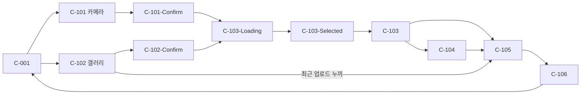
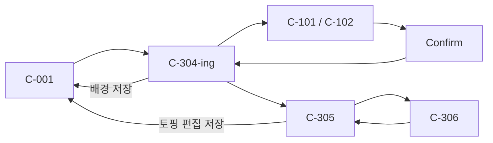
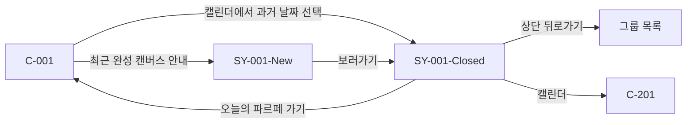

# 캔버스 정책문서

> 캔버스 화면 흐름과 확정 정책을 Figma, 기존 문서와 기능 정의를 기준으로 정리한 단일 정책 문서다.

이 문서는 캔버스 기본 화면, 과거 캔버스, 토핑 추가, Spotlight, 배경 편집과 기존 토핑 편집의 확정 정책을 관리한다.

정책 문서 ID는 화면 ID `C-xxx`와 혼동되지 않도록 `CAN-xxx`를 사용한다. 각 정책은 제공된 `policy-template.md`의 구조와 `policy-writing-guide.md`의 규범 문장 작성 규칙을 따른다.

## 1. 기준 자료와 우선순위

1. 화면 ID와 표기 방식은 기존 문서를 기준으로 한다.
2. 캘린더 날짜·월·연도 노출은 기록을 기준으로 하는 기존 문서를 따른다.
3. 화면 문구와 시각·동작 정책은 [파르페 v0.1 캔버스 Figma](https://www.figma.com/design/QPoxqbNMNktsi8ktua3gMN/-%EB%94%94%EC%9E%90%EC%9D%B8--%ED%8C%8C%EB%A5%B4%ED%8E%98-v0.1?node-id=52-6)를 따른다.

## 2. 정책 구성

| 정책 ID | 정책 | 주요 화면 |
|---|---|---|
| CAN-001 | 캔버스 기본 화면 | C-001, C-001-Empty, C-001-2depth |
| CAN-002 | 캔버스 캘린더 | C-201, C-201-SelectYear, C-201-SelectMonth |
| CAN-003 | 과거 캔버스 | SY-001-New, SY-001-Closed, SY-001-Closed-Toast |
| CAN-004 | 사진 입력 | C-101, C-102와 상태 변형 |
| CAN-005 | 오브젝트 분석 | C-103-Loading, C-103-Error, C-103-Selected, C-103 |
| CAN-006 | 누끼·테두리 편집 | C-104, C-105 |
| CAN-007 | 신규 토핑 배치 | C-106 |
| CAN-008 | 토핑 Spotlight | C-202 |
| CAN-009 | 캔버스 배경 편집 | C-301~C-304-ing, C-304-Toast |
| CAN-010 | 기존 토핑 조작 | C-305 |
| CAN-011 | 기존 토핑 편집 저장 | C-305, C-306 |

## 3. 화면 상태 분류

접미사가 붙은 프레임은 별도 기능 화면이 아니라 기본 화면의 상태 변형으로 분류한다.

| 접미사 | 상태 의미 |
|---|---|
| `-Loading` | 비동기 처리 중 |
| `-Error` | 권한·분석 등 오류 |
| `-Toast` | 기본 화면 위 안내 또는 확인 UI 표시 |
| `-Empty` | 표시할 콘텐츠 없음 |
| `-Confirm` | 사진 또는 결과 확정 전 |
| `-Reselect` | 사진 재선택 가능 |
| `-Selected` | 후보 또는 대상 선택 |
| `-SelectYear` | 연도 목록 열림 |
| `-SelectMonth` | 월 목록 열림 |
| `-2depth` | 캔버스 메뉴의 하위 메뉴 열림 |
| `(Spotlighted)` | 특정 토핑 강조 |

`C-103-Selected`의 `1269:2135`와 `2573:8001`은 별도 상태가 아니라 기기 높이에 따른 반응형 프레임이다.

## 4. 전체 화면 흐름

### 4.1 토핑 추가

### 4.2 캔버스 편집

### 4.3 과거 캔버스

## 5. Figma 프레임별 정책 연결

| 화면·상태 | 의미 | Figma node | 적용 정책 |
|---|---|---|---|
| C-001 | 오늘 캔버스 기본 화면 | `1796:6792`, `1796:4727`, `1882:3977`, `1782:7532`, `1782:6782` | CAN-001 |
| C-001-Empty | 토핑과 별도 배경이 없는 상태 | `1841:7690` | CAN-001 |
| C-001-2depth | 토핑 추가 하위 메뉴 | `1782:5508` | CAN-001, CAN-004 |
| C-201 | 캘린더 기본 상태 | `1796:4253` | CAN-002 |
| C-201-SelectYear | 연도 목록이 열린 상태 | `1809:3661` | CAN-002 |
| C-201-SelectMonth | 월 목록이 열린 상태 | `1809:4771` | CAN-002 |
| C-202 | 다른 사용자 토핑 Spotlight | `1796:7547` | CAN-008 |
| SY-001-New | 최근 완성 캔버스 안내 | `1799:9577` | CAN-003 |
| SY-001-Closed | 과거 캔버스 열람 | `1800:11987` | CAN-003 |
| SY-001-Closed-Toast | 앨범 저장 성공·실패 | `1800:12762`, `1972:3581` | CAN-003 |
| C-101 | 카메라 촬영 | `1841:7622` | CAN-004 |
| C-101-Toast | 촬영 품질 안내 | `1704:19350`, `1882:3870` | CAN-004 |
| C-101-Confirm | 촬영 사진 확인 | `1000:2960` | CAN-004 |
| C-101-Error | 카메라 권한 오류 | `708:2964` | CAN-004 |
| C-102 | 커스텀 갤러리 | `1047:7853` | CAN-004 |
| C-102-Toast | 사진 품질 안내 | `1882:3919` | CAN-004 |
| C-102-Reselect | 사진 재선택 | `1047:7923` | CAN-004 |
| C-102-Empty | 선택 가능한 사진 없음 | `2483:8187`, `2573:8041` | CAN-004 |
| C-102-Confirm | 갤러리 사진 확인 | `1047:7544` | CAN-004 |
| C-102-Error | 사진 권한 오류 | `708:2989` | CAN-004 |
| C-103-Loading | 사진 분석 중 | `1047:7997` | CAN-005 |
| C-103-Error | 분석 실패 또는 후보 없음 | `1075:1546` | CAN-005 |
| C-103-Selected | 후보 오브젝트 선택 | `1269:2135`, `2573:8001` | CAN-005 |
| C-103 | 자동 누끼 결과 확인 | `1081:5709` | CAN-005 |
| C-104 | 수동 누끼 편집 | `1830:20423`, `1833:22354` | CAN-006 |
| C-105 | 신규 토핑 테두리 편집 | `1171:6733`, `1179:6921` | CAN-006 |
| C-106 | 신규 토핑 배치 | `1187:7233` | CAN-007 |
| C-304-ing | 배경과 기존 토핑 편집 모드 | `1882:4802`, `2048:4500` | CAN-009, CAN-011 |
| C-304-Toast | 배경 편집 취소 확인 | `2048:4882` | CAN-009 |
| C-305 | 기존 토핑 조작 | `2048:4204`, `2048:4415` | CAN-010, CAN-011 |
| C-306 | 기존 토핑 테두리 편집 | `2048:4698` | CAN-011 |

## 6. 확정 정책에서 제외한 항목

다음 항목은 Figma 화면이나 확정된 제품 동작이 없으므로 이 정책 묶음에서 규정하지 않는다.

- C-104의 최대 확대 배율
- C-106의 위치·크기·회전 입력 방식과 최대 크기
- C-304-ing 배경 저장 API 실패 처리
- C-305 편집 저장 API 실패 처리
- 갤러리 저장 권한 거부 전용 처리

C-301, C-302와 C-303은 독립 Figma 프레임이 아니라 C-304-ing 진입 및 카메라·갤러리 배경 입력을 가리키는 논리 동작 ID다.

---

## CAN-001 캔버스 기본 화면 정책

> **한 줄 요약** — 캔버스 기본 화면은 오늘의 배경과 토핑을 16:9 보드에 합성하고 토핑 추가와 캔버스 편집 진입점을 제공해야 한다.
>
> **강제성** — 캔버스 기본 화면의 구현과 QA는 이 정책을 준수해야 한다.

### 1. 목적

캔버스 기본 화면의 크기 계산, 빈 상태 판정과 이미지 저장 범위가 문서마다 흩어져 있어 동일한 API 결과가 서로 다르게 표현될 수 있었다. 이 정책은 C-001의 렌더링과 기본 메뉴를 하나의 판정 기준으로 고정한다.

### 2. 적용 범위

- **적용 대상**: C-001, C-001-Empty, C-001-2depth
- **적용 제외**: 과거 캔버스 SY-001-Closed, 캘린더 C-201, Spotlight C-202

### 3. 규칙

- **3.1** C-001의 `60pt` 상단 바는 뒤로가기, 그룹명, 최대 5명의 `YGNametagChip`, 초과 인원 수와 메뉴 버튼을 표시하고 뒤로가기 버튼 또는 스와이프로 캔버스 기능을 닫아야 한다.
- **3.2** C-001은 `whiteFixed` 배경 위에 `2 × 2pt` 크기의 `gray100` 점을 좌측 상단 기준 `22pt` 간격으로 반복해야 한다.
- **3.3** C-001은 `44pt` Canvas-Menu를 제외한 Canvas-Area를 16:9 비율과 좌측 상단 `17pt` cut 및 `gray500` `1pt` 테두리로 구성하고 상하 최소 `12pt`와 좌우 기본 `20pt` 여백을 유지해야 한다.
- **3.4** C-001은 선택 날짜를 표시하는 `44pt` `White75` 날짜 헤더를 Canvas-Area의 잘린 모서리 위에 배치하되 이미지 저장 결과에는 날짜 헤더와 잘린 모서리를 포함해서는 안 된다.
- **3.5** C-001은 배경이 없으면 `gray100`, 색상이면 지정 색상, 이미지면 지정 이미지를 Canvas-Area 크기에 맞춰 렌더링해야 한다.
- **3.6** C-001은 각 토핑의 저장된 위치, 크기 배율, 회전, z-index와 테두리 값을 Canvas-Area의 스케일에 맞춰 합성해야 한다.
- **3.7** C-001은 토핑과 별도 배경이 모두 없을 때만 C-001-Empty를 표시해야 한다.
- **3.8** C-001은 기본 Canvas-Menu에 `토핑 추가`와 `캔버스 편집`을 표시하고 `토핑 추가` 선택 시 카메라 C-101과 갤러리 C-102만 제공해야 한다.

### 4. 예시

#### 4.1 허용되는 경우

- 토핑은 없지만 사용자가 지정한 단색 배경이 있어 채워진 캔버스로 표시하는 경우
- 세로 공간이 부족해 16:9 비율을 유지하도록 Canvas-Area를 줄이고 좌우 여백이 20pt보다 커지는 경우

#### 4.2 허용되지 않는 경우

- 캔버스를 앨범에 저장하면서 날짜 헤더까지 이미지에 포함하는 경우
- 배경 이미지가 있다는 이유만으로 C-001-Empty를 표시하는 경우

#### 4.3 판단이 갈리는 경우

| 상황 | 처리 |
|---|---|
| 토핑이 없고 기본 `gray100`만 표시됨 | §3.7에 따라 C-001-Empty를 표시한다 |
| 토핑이 없고 사용자가 선택한 `gray100` 배경이 저장됨 | 별도 배경 데이터가 있으므로 채워진 캔버스로 표시한다 |

### 5. 예외

이 정책에는 예외를 두지 않는다.

---

## CAN-002 캔버스 캘린더 정책

> **한 줄 요약** — 캔버스 캘린더는 기록이 있는 과거 날짜와 오전 3시 경계의 오늘만 선택할 수 있게 제공해야 한다.
>
> **강제성** — 캔버스 캘린더의 구현과 QA는 이 정책을 준수해야 한다.

### 1. 목적

Figma의 편의를 위한 연·월 예시와 실제 기록 기반 노출 규칙이 달라 선택할 수 없는 날짜가 노출될 수 있었다. 이 정책은 기록 조회 결과를 기준으로 캘린더 탐색과 과거 캔버스 진입을 일관되게 만든다.

### 2. 적용 범위

- **적용 대상**: C-201, C-201-SelectYear, C-201-SelectMonth와 SY-001-Closed에서 여는 C-201
- **적용 제외**: 과거 캔버스의 열람·저장 동작, 캔버스 API의 오류 화면

### 3. 규칙

- **3.1** C-201은 날짜 헤더의 캘린더 아이콘을 탭할 때 현재 표시 중인 캔버스 날짜의 연·월로 초기화된 overlay와 나머지 화면의 dim을 표시해야 한다.
- **3.2** C-201은 아이콘 재탭 또는 기본 grid의 dim 탭 시 탐색 중인 미선택 연·월을 폐기하며 전체를 닫고 연·월 목록이 열린 상태의 첫 dim 탭 시 목록만 닫아야 한다.
- **3.3** C-201은 월·연도 선택 시 탐색 grid만 즉시 갱신하고 사용자가 날짜 셀을 선택하기 전까지 실제 캔버스 날짜를 변경해서는 안 된다.
- **3.4** C-201은 이전 파르페 목록 API의 `date`에 존재하는 연도와 월만 한 번에 한 종류의 목록으로 표시하고 항목이 6개 이상이면 행 높이 `44pt`와 최대 높이 `220pt`의 스크롤 목록을 사용해야 한다.
- **3.5** C-201은 기록이 있는 과거 날짜와 기기 현지 시각 오전 3시를 경계로 계산한 오늘만 활성화하고 미래 날짜와 기록 없는 과거 날짜를 비활성화해야 한다.
- **3.6** C-201은 Gregorian Calendar의 일요일 시작 grid를 사용하고 기록과 접근 범위를 만족하는 인접 월 날짜도 선택 가능하게 표시해야 한다.
- **3.7** C-201은 기록 날짜에 `4 × 4pt` `cherry` 인디케이터를 표시하고 선택 날짜에는 `32 × 32pt` `gray900` 원을 표시해야 한다.
- **3.8** C-201은 날짜 선택 시 캘린더를 닫고 해당 날짜의 상세 캔버스를 조회한 뒤 과거 날짜이면 SY-001-Closed로 이동해야 한다.

### 4. 예시

#### 4.1 허용되는 경우

- 2026년 기록이 3월과 6월에만 있으면 월 목록에 March와 June만 표시하는 경우
- 8월 grid에 보이는 7월 31일에 기록이 있으면 해당 인접 월 날짜를 바로 선택하는 경우

#### 4.2 허용되지 않는 경우

- Figma 예시에 연도가 있다는 이유로 기록이 없는 연도를 목록에 표시하는 경우
- 오전 1시에 달력의 날짜가 바뀌었다는 이유로 새 날짜를 오늘로 처리하는 경우

#### 4.3 판단이 갈리는 경우

| 상황 | 처리 |
|---|---|
| 오늘 날짜에 기록이 없음 | §3.5에 따라 오늘은 활성화하되 기록 인디케이터는 표시하지 않는다 |
| 월·연도 목록이 열린 상태에서 dim을 두 번 탭함 | 첫 탭은 목록을 닫고 두 번째 탭은 캘린더 전체를 닫는다 |

### 5. 예외

이 정책에는 예외를 두지 않는다.

---

## CAN-003 과거 캔버스 정책

> **한 줄 요약** — 과거 캔버스는 가장 최근 완성본 안내와 기록 열람·앨범 저장만 제공하고 모든 편집 기능을 차단해야 한다.
>
> **강제성** — 과거 캔버스의 구현과 QA는 이 정책을 준수해야 한다.

### 1. 목적

과거 날짜에서도 오늘의 메뉴가 보인다는 초기 해석 때문에 과거 캔버스에 토핑을 추가하거나 편집할 수 있는지 혼선이 있었다. 이 정책은 오늘 캔버스와 과거 완성 캔버스의 상태와 허용 동작을 명확히 분리한다.

### 2. 적용 범위

- **적용 대상**: 오늘의 파르페 조회 결과, SY-001-New, SY-001-Closed, SY-001-Closed-Toast
- **적용 제외**: 배경·토핑 편집 저장 실패, 사진 앨범 권한 거부 전용 처리

### 3. 규칙

- **3.1** 캔버스 기능은 화면 진입 때마다 오늘의 파르페 조회 API를 호출하고 `ACTIVE`, `CLOSED`, `EMPTY` 중 `ACTIVE`를 오늘의 새 캔버스가 발급된 상태로 해석해야 한다.
- **3.2** 캔버스 기능은 오전 3시 이후 과거 완성 캔버스가 존재하고 오늘의 파르페 조회 API가 `ACTIVE`를 반환하지 않을 때만 SY-001-New를 표시해야 한다.
- **3.3** SY-001-New는 과거 완성 캔버스가 여러 개이면 가장 최근 완성본의 날짜와 함께한 친구 수를 안내해야 한다.
- **3.4** SY-001-New의 `보러가기`는 안내한 날짜의 SY-001-Closed로 이동해야 한다.
- **3.5** SY-001-Closed는 C-201에서 선택한 기록 보유 과거 날짜 또는 SY-001-New가 안내한 날짜의 완성 캔버스를 표시해야 한다.
- **3.6** SY-001-Closed는 토핑 선택, Spotlight, 토핑 추가와 캔버스 편집을 제공해서는 안 된다.
- **3.7** SY-001-Closed는 상단 뒤로가기 시 그룹 목록으로 이동하고 캘린더 아이콘 선택 시 C-201을 열며 `오늘의 파르페 가기` 선택 시 오늘의 C-001로 이동해야 한다.
- **3.8** SY-001-Closed는 `갤러리에 저장` 결과에 따라 성공 시 `N월 N일의 캔버스가 갤러리에 저장됐어요`, 실패 시 `갤러리 저장에 실패했어요. 나중에 다시 시도해 주세요.` Toast를 표시해야 한다.

### 4. 예시

#### 4.1 허용되는 경우

- 오전 3시 이후 오늘 상태가 `EMPTY`이고 완성된 과거 캔버스가 있어 가장 최근 완성본을 SY-001-New로 안내하는 경우
- SY-001-Closed에서 캘린더를 열어 기록이 있는 다른 과거 날짜로 이동하는 경우

#### 4.2 허용되지 않는 경우

- 과거 캔버스 하단에 `토핑 추가` 또는 `캔버스 편집`을 표시하는 경우
- 오늘 상태가 `ACTIVE`인데 SY-001-New를 표시하는 경우

#### 4.3 판단이 갈리는 경우

| 상황 | 처리 |
|---|---|
| 완성된 과거 캔버스가 여러 개임 | §3.3에 따라 가장 최근 완성본 하나만 안내한다 |
| SY-001-Closed에서 상단 뒤로가기를 탭함 | 오늘 C-001이 아니라 그룹 목록으로 이동한다 |

### 5. 예외

이 정책에는 예외를 두지 않는다.

---

## CAN-004 캔버스 사진 입력 정책

> **한 줄 요약** — 카메라와 커스텀 갤러리는 진입 목적을 보존하고 사진 확정 후 토핑 분석 또는 배경 편집으로 정확히 복귀해야 한다.
>
> **강제성** — 캔버스 사진 입력의 구현과 QA는 이 정책을 준수해야 한다.

### 1. 목적

C-101과 C-102가 토핑 추가와 배경 편집에 함께 사용되면서 사진 확정 후 잘못된 후속 화면으로 이동할 가능성이 있었다. 이 정책은 공용 사진 입력 화면의 origin, 날짜와 복귀 경로를 고정한다.

### 2. 적용 범위

- **적용 대상**: C-101, C-101-Confirm, C-101-Error, C-101-Toast, C-102, C-102-Confirm, C-102-Error, C-102-Toast, C-102-Empty, C-102-Reselect
- **적용 제외**: C-103 이후 누끼 처리, 사진을 배경으로 적용한 뒤의 C-304-ing 저장

### 3. 규칙

- **3.1** C-001의 토핑 추가 메뉴는 `카메라로 촬영` 선택 시 C-101, `갤러리에서 선택` 선택 시 C-102를 `toppingAdd` origin으로 열어야 한다.
- **3.2** C-304-ing의 카메라와 갤러리 버튼은 각각 C-101과 C-102를 `canvasBackgroundEdit` origin으로 열어야 한다.
- **3.3** C-101과 C-102는 캘린더 선택 날짜와 관계없이 기기 현지 시각 오전 3시 경계의 오늘 날짜를 표시해야 한다.
- **3.4** C-101은 상단 UI와 촬영 버튼 사이의 가변 viewfinder에 상단 `8pt`와 하단 `10pt` 간격을 두고 외부에 `Transparency/Black-25`와 blur `4`를 적용하며 촬영 결과는 C-101-Confirm, 권한 없음은 C-101-Error, 촬영 품질 안내는 한 번의 C-101-Toast로 표시해야 한다.
- **3.5** C-102는 일반 사진과 테두리를 제외한 최근 업로드 누끼를 구분하고 최근 업로드 누끼를 오전 3시에 만료되는 기기 내부 데이터로 관리해야 한다.
- **3.6** C-102는 당일 사진과 최근 업로드 누끼가 모두 없으면 C-102-Empty, 사진을 다시 고를 수 있으면 C-102-Reselect, 권한이 없으면 C-102-Error를 표시하며 사진 품질 안내는 C-102-Toast로 한 번만 표시해야 한다.
- **3.7** C-102는 `toppingAdd` origin에서 최근 업로드 누끼를 선택하면 C-103과 C-104를 생략하고 C-105로 이동해야 한다.
- **3.8** C-101과 C-102는 재촬영·재선택·닫기에서도 origin을 유지하고 Confirm 확정 시 `toppingAdd`이면 C-103-Loading, `canvasBackgroundEdit`이면 C-304-ing으로 이동해야 한다.

### 4. 예시

#### 4.1 허용되는 경우

- 배경 편집에서 갤러리로 이동한 뒤 사진을 다시 선택해도 최종 확정 시 C-304-ing으로 돌아오는 경우
- 토핑 추가에서 최근 업로드 누끼를 선택해 곧바로 C-105 테두리 편집으로 이동하는 경우

#### 4.2 허용되지 않는 경우

- 배경 사진을 확정한 뒤 C-103-Loading으로 이동하는 경우
- 최근 업로드 누끼에 이전 테두리까지 합성해 저장하는 경우

#### 4.3 판단이 갈리는 경우

| 상황 | 처리 |
|---|---|
| 오전 2시 30분에 C-101을 열었음 | 오전 3시 경계에 따라 전날을 오늘 날짜로 표시한다 |
| 배경 편집 origin에서 C-101의 X를 탭함 | §3.8에 따라 C-304-ing으로 돌아간다 |

### 5. 예외

이 정책에는 예외를 두지 않는다.

---

## CAN-005 토핑 오브젝트 분석 정책

> **한 줄 요약** — 토핑 사진 분석은 후보 하나를 선택해 안전 여백을 포함한 동일 추출 캔버스로 자동 누끼 결과를 생성해야 한다.
>
> **강제성** — 토핑 오브젝트 분석의 구현과 QA는 이 정책을 준수해야 한다.

### 1. 목적

후보 선택 화면, 자동 누끼 결과와 이후 편집 화면의 이미지 기준이 달라지면 오브젝트 크기와 여백이 단계마다 흔들릴 수 있었다. 이 정책은 분석 상태, 후보 선택과 추출 캔버스의 기준을 통일한다.

### 2. 적용 범위

- **적용 대상**: C-103-Loading, C-103-Error, C-103-Selected, C-103
- **적용 제외**: C-104 수동 마스크 조작, C-105 테두리 조작, 배경 편집 origin의 사진

### 3. 규칙

- **3.1** 토핑 추가 origin의 C-101-Confirm 또는 C-102-Confirm은 사진 확정 시 C-103-Loading으로 이동해야 한다.
- **3.2** C-103-Loading은 분석이 끝날 때까지 후보 선택과 하단 확정 액션을 제공해서는 안 된다.
- **3.3** 분석 기능은 후보 감지 성공 시 C-103-Selected로 이동하고 분석 실패 또는 후보 없음 시 원본과 진입점을 보존한 C-103-Error를 표시하며 C-103-Error의 X 선택 시 원래 Confirm 화면으로 돌아가야 한다.
- **3.4** C-103-Selected는 한 번에 후보 하나만 선택하게 하고 후보 선택 시 C-103으로 이동하며 상단에는 원래 Confirm 화면으로 돌아가는 뒤로가기만 제공해야 한다.
- **3.5** C-103-Selected는 기본적으로 Figma `1269:2135` 레이아웃을 사용하고 작은 기기에서 안내 문구가 두 줄이면 `2573:8001` 레이아웃을 사용해야 한다.
- **3.6** C-103은 선택 후보의 자동 누끼를 표시하고 `사진 편집` 선택 시 C-104, `다음` 선택 시 C-105, X 또는 뒤로가기 선택 시 C-103-Selected로 이동해야 한다.
- **3.7** 분석 기능은 후보의 최소 바운딩 박스 상하좌우에 각각 20% 안전 여백을 추가하고 원본 밖의 부족한 여백을 알파 0% 픽셀로 채운 추출 캔버스를 생성해야 한다.
- **3.8** C-103부터 C-105까지는 동일한 추출 캔버스를 `Device Width - 40pt` 이하와 상하단 UI 여백을 제외한 높이 이하에서 Aspect Fit으로 중앙 정렬해야 한다.

### 4. 예시

#### 4.1 허용되는 경우

- 사진 가장자리에 붙은 오브젝트의 부족한 안전 여백을 투명 픽셀로 확장하는 경우
- 작은 기기에서 안내 문구가 두 줄이 되어 반응형 C-103-Selected 프레임을 사용하는 경우

#### 4.2 허용되지 않는 경우

- C-103-Selected에서 후보 두 개를 동시에 선택하는 경우
- C-104로 이동할 때 오브젝트 본체만 다시 crop해 추출 캔버스 크기를 바꾸는 경우

#### 4.3 판단이 갈리는 경우

| 상황 | 처리 |
|---|---|
| 분석은 완료됐지만 후보가 없음 | §3.3에 따라 C-103-Error를 표시한다 |
| C-103에서 X를 탭함 | 앱 흐름을 종료하지 않고 C-103-Selected로 돌아간다 |

### 5. 예외

이 정책에는 예외를 두지 않는다.

---

## CAN-006 토핑 누끼·테두리 편집 정책

> **한 줄 요약** — 수동 누끼와 테두리 편집은 동일 추출 캔버스를 유지하며 마스크와 알파 실루엣의 외곽선만 변경해야 한다.
>
> **강제성** — 토핑 누끼·테두리 편집의 구현과 QA는 이 정책을 준수해야 한다.

### 1. 목적

수동 누끼의 브러시 동작과 테두리의 기준이 불명확하면 원본 배경이 섞이거나 사각형 테두리가 그려질 수 있었다. 이 정책은 C-104와 C-105가 수정하는 데이터와 화면 전이를 분리해 규정한다.

### 2. 적용 범위

- **적용 대상**: C-104, C-105와 C-102 최근 업로드 누끼에서 진입한 C-105
- **적용 제외**: C-104의 미확정 최대 확대 배율, C-106의 캔버스 배치 transform

### 3. 규칙

- **3.1** C-104의 `영역 지우기`는 브러시가 지난 픽셀을 최종 누끼에서 제외하고 `영역 채우기`는 최종 누끼에 포함해야 한다.
- **3.2** C-104는 제외된 원본 픽셀을 50% opacity로 표시하고 복구된 픽셀을 100% opacity로 표시해야 한다.
- **3.3** C-104는 `2px`부터 `50px`까지의 브러시와 단일 손가락 또는 Apple Pencil 입력을 제공해야 한다.
- **3.4** C-104는 두 손가락 입력을 pinch와 pan으로 처리하고 마스크 변경에만 적용되는 undo와 redo를 제공해야 한다.
- **3.5** C-104는 이미지를 상하단 UI와 최소 `10pt` 떨어진 영역에 Aspect Fit으로 중앙 정렬하고 초기 `scale 1.0`보다 축소하거나 작업 뷰포트 밖으로 완전히 이동하게 해서는 안 된다.
- **3.6** C-104는 X 선택 시 마스크 초안을 유지한 채 C-103-Selected로 이동하고 `테두리` 또는 체크 선택 시 C-105로 이동해야 한다.
- **3.7** C-105는 누끼 알파 실루엣 바깥쪽에 `2px`부터 `50px`까지의 테두리를 없음, 흰색, 검정, 분홍, 주황, 노랑, 초록, 하늘, 보라 순서로 적용하고 `없음`에서도 마지막 굵기 값을 초안에 유지해야 한다.
- **3.8** C-105는 테두리 변경에만 적용되는 undo와 redo를 제공하고 X 선택 시 자동 경로는 C-103-Selected, 수동 경로는 C-104로 이동하며 체크 선택 시 C-106으로 이동해야 한다.

### 4. 예시

#### 4.1 허용되는 경우

- 테두리 없음을 선택해 stroke는 숨기되 마지막 굵기 값을 편집 초안에 유지하는 경우
- 수동 누끼에서 두 손가락으로 이미지를 확대하고 한 손가락으로 마스크를 칠하는 경우

#### 4.2 허용되지 않는 경우

- 누끼 이미지의 사각 바운딩 박스에 직사각형 stroke를 그리는 경우
- C-105의 undo가 C-104에서 확정한 마스크까지 되돌리는 경우

#### 4.3 판단이 갈리는 경우

| 상황 | 처리 |
|---|---|
| 최근 업로드 누끼에서 C-105로 진입함 | 누끼 편집을 생략하고 현재 테두리 초안만 편집한다 |
| C-104에서 이미지 전체가 화면 밖으로 밀림 | §3.5에 따라 완전 이탈하지 않도록 pan 범위를 제한한다 |

### 5. 예외

이 정책에는 예외를 두지 않는다.

---

## CAN-007 신규 토핑 배치 정책

> **한 줄 요약** — 신규 토핑은 C-106에서 중앙과 기준 크기로 시작해 캔버스 이탈을 허용한 상태로 오늘 캔버스에 저장해야 한다.
>
> **강제성** — 신규 토핑 배치의 구현과 QA는 이 정책을 준수해야 한다.

### 1. 목적

신규 토핑의 초기 크기와 기존 토핑의 저장된 transform이 같은 규칙으로 오해되어 기존 배치가 초기화될 수 있었다. 이 정책은 C-106에만 적용되는 초기 transform과 경계 처리를 규정한다.

### 2. 적용 범위

- **적용 대상**: C-105에서 생성한 신규 토핑의 C-106 배치
- **적용 제외**: 저장된 기존 토핑을 편집하는 C-305, 과거 캔버스, C-106의 미확정 조작 입력 방식과 최대 크기

### 3. 규칙

- **3.1** C-105는 체크 선택 시 현재 누끼와 테두리 설정을 유지한 신규 토핑을 C-106으로 전달해야 한다.
- **3.2** C-106은 신규 토핑의 중심을 Canvas-Area의 가로·세로 중앙에 배치해야 한다.
- **3.3** C-106은 신규 토핑의 긴 변이 Canvas-Area 너비의 40%가 되도록 초기 크기를 계산해야 한다.
- **3.4** C-106은 §3.3 적용 후 짧은 변이 `48px` 미만이면 원본 비율을 유지한 채 짧은 변을 `48px`로 확대해야 한다.
- **3.5** C-106은 사용자가 신규 토핑의 위치, 크기와 회전을 변경할 수 있게 해야 한다.
- **3.6** C-106은 토핑의 일부 또는 전체가 Canvas-Area 밖으로 이동하는 것을 허용하고 이탈 픽셀을 clipping mask로 잘라야 한다.
- **3.7** C-106은 토핑을 Canvas-Area 안으로 자동 복귀시키거나 가장자리에 snap해서는 안 된다.
- **3.8** C-106은 X 선택 시 배치 초안을 저장하지 않고 C-105로 이동하며 체크 선택 시 오늘 캔버스에 토핑을 저장하고 C-001로 이동해야 한다.

### 4. 예시

#### 4.1 허용되는 경우

- 세로로 긴 신규 토핑의 세로 길이를 Canvas-Area 너비의 40%로 맞추고 중앙에 표시하는 경우
- 토핑 전체를 캔버스 밖으로 옮긴 상태로 저장하는 경우

#### 4.2 허용되지 않는 경우

- 신규 토핑의 짧은 변을 30px로 렌더링하는 경우
- 경계 밖으로 이동한 토핑을 손을 놓는 순간 자동으로 캔버스 안에 되돌리는 경우

#### 4.3 판단이 갈리는 경우

| 상황 | 처리 |
|---|---|
| 긴 변 40% 적용 후 짧은 변이 48px보다 작음 | §3.4를 우선 적용해 전체 크기를 비율대로 키운다 |
| C-106에서 X를 탭함 | C-105로 돌아가며 위치·크기·회전 초안은 확정하지 않는다 |

### 5. 예외

이 정책에는 예외를 두지 않는다.

---

## CAN-008 토핑 Spotlight 정책

> **한 줄 요약** — 오늘 캔버스의 다른 사용자 토핑은 한 번에 하나만 Spotlight할 수 있으며 다른 토핑 선택 전에 Spotlight를 해제해야 한다.
>
> **강제성** — 토핑 Spotlight의 구현과 QA는 이 정책을 준수해야 한다.

### 1. 목적

토핑 탭이 Spotlight와 편집 진입 중 어떤 동작을 수행하는지, 강조 중 다른 토핑을 바로 선택할 수 있는지가 정의되지 않았다. 이 정책은 토핑 소유자와 캔버스 날짜에 따른 탭 결과를 고정한다.

### 2. 적용 범위

- **적용 대상**: 오늘 C-001의 C-202 Spotlight 상태
- **적용 제외**: 과거 SY-001-Closed, C-305 편집 모드의 토핑 선택

### 3. 규칙

- **3.1** C-001은 오늘 캔버스에서 다른 사용자의 토핑을 탭하면 해당 토핑을 C-202 Spotlight 상태로 전환해야 한다.
- **3.2** C-202는 선택 토핑을 최상위 z-index에 두고 그 아래 `Transparency/Black-50` dim 레이어와 기존 순서를 유지한 나머지 토핑을 배치해야 한다.
- **3.3** C-202는 진입할 때 `{닉네임} 님이 {상대시간} 전에 쌓았어요` 형식의 Toast를 한 번만 표시해야 한다.
- **3.4** C-202는 탈퇴하거나 그룹에서 나간 사용자의 닉네임을 `알 수 없음`으로 표시해야 한다.
- **3.5** C-202는 Spotlight 상태에서 다른 토핑을 바로 선택하게 해서는 안 된다.
- **3.6** C-202는 빈 영역 또는 선택되지 않은 dim 영역을 탭하면 Spotlight를 해제하고 C-001 Default 상태로 돌아가야 한다.
- **3.7** C-001은 내가 추가한 토핑을 탭하면 Spotlight를 적용하지 않고 C-305로 이동해야 한다.
- **3.8** C-001은 과거 캔버스에서 Spotlight를 제공해서는 안 되며 앱 복귀 또는 Pull-to-Refresh 시 활성 Spotlight를 먼저 해제해야 한다.

### 4. 예시

#### 4.1 허용되는 경우

- 다른 사용자의 토핑을 강조한 뒤 빈 영역을 탭해 해제하고 다른 토핑을 선택하는 경우
- 탈퇴한 사용자의 토핑을 Spotlight하고 `알 수 없음 님이 3분 전에 쌓았어요`를 표시하는 경우

#### 4.2 허용되지 않는 경우

- Spotlight 상태의 다른 토핑을 탭해 강조 대상을 즉시 교체하는 경우
- SY-001-Closed의 토핑을 Spotlight하는 경우

#### 4.3 판단이 갈리는 경우

| 상황 | 처리 |
|---|---|
| Spotlight Toast가 사라진 뒤 같은 Spotlight 상태를 유지함 | 같은 진입에서는 Toast를 다시 표시하지 않는다 |
| 내 토핑을 탭함 | §3.7에 따라 C-305로 이동한다 |

### 5. 예외

이 정책에는 예외를 두지 않는다.

---

## CAN-009 캔버스 배경 편집 정책

> **한 줄 요약** — 오늘 캔버스의 배경 편집은 C-304-ing에서 색상 또는 이미지를 미리 반영하고 체크 시 API에 저장해야 한다.
>
> **강제성** — 캔버스 배경 편집의 구현과 QA는 이 정책을 준수해야 한다.

### 1. 목적

Notion DB의 C-301~C-303이 독립 화면처럼 해석됐지만 Figma에는 해당 프레임이 없고 실제 편집은 C-304-ing에서 수행된다. 이 정책은 논리 동작 ID와 실제 화면을 구분하고 배경 초안의 저장·취소 흐름을 규정한다.

### 2. 적용 범위

- **적용 대상**: C-301, C-302, C-303, C-304-ing, C-304-Color, C-304-Img, C-304-Toast
- **적용 제외**: 배경 저장 API 실패 처리, 과거 캔버스, 기존 토핑의 C-305 편집

### 3. 규칙

- **3.1** 캔버스 기능은 C-301을 C-304-ing 진입, C-302를 카메라 배경 입력, C-303을 갤러리 배경 입력의 논리 동작 ID로 사용하고 독립 화면으로 구현해서는 안 된다.
- **3.2** C-001은 오늘 캔버스에서 `캔버스 편집`을 선택할 때만 C-304-ing으로 이동해야 한다.
- **3.3** C-304-ing은 저장된 배경이 단색이면 현재 색상 칩을 선택하고 저장된 배경이 이미지면 해당 이미지를 초기 배경으로 표시해야 한다.
- **3.4** C-304-ing은 사용자가 색상 칩 또는 이미지를 선택하면 배경 편집 초안에 즉시 반영해야 한다.
- **3.5** C-304-ing은 카메라와 갤러리 버튼으로 C-101 또는 C-102를 `canvasBackgroundEdit` origin으로 열고 사진 확정 후 C-304-ing으로 복귀해야 한다.
- **3.6** 캔버스 기능은 배경 이미지로 사용한 사진을 최근 업로드 누끼나 별도 원본 사진으로 저장해서는 안 된다.
- **3.7** C-304-ing은 체크 선택 시 배경 편집 결과를 API에 즉시 저장한 뒤 C-001로 이동해야 한다.
- **3.8** C-304-ing은 X 선택 시 C-304-Toast를 표시하고 `그만두기` 선택 시 초안을 폐기한 뒤 C-001로 이동하며 `계속 편집하기` 선택 시 C-304-ing을 유지해야 한다.

### 4. 예시

#### 4.1 허용되는 경우

- 단색 배경으로 진입해 기존 색상 칩이 선택된 상태에서 다른 칩을 탭하자 즉시 미리보기가 바뀌는 경우
- 갤러리에서 배경 사진을 재선택한 뒤 같은 C-304-ing 초안에 반영하는 경우

#### 4.2 허용되지 않는 경우

- C-302라는 별도 화면을 만들어 C-304-ing과 중복 구현하는 경우
- C-304-ing에서 X를 누르는 즉시 확인 없이 변경 내용을 저장하는 경우

#### 4.3 판단이 갈리는 경우

| 상황 | 처리 |
|---|---|
| 배경 편집에서 카메라 화면의 X를 탭함 | CAN-004 §3.8에 따라 기존 C-304-ing으로 돌아간다 |
| C-304-Toast에서 `계속 편집하기`를 탭함 | 배경 초안을 유지한 C-304-ing에 머문다 |

### 5. 예외

이 정책에는 예외를 두지 않는다.

---

## CAN-010 기존 토핑 조작 정책

> **한 줄 요약** — C-305는 내 토핑 하나만 선택해 삭제·크기·회전·위치를 초안으로 편집할 수 있게 해야 한다.
>
> **강제성** — 기존 토핑 조작의 구현과 QA는 이 정책을 준수해야 한다.

### 1. 목적

C-305의 Figma가 네 모서리 조작 버튼을 갖도록 변경되면서 핀치 지원, 경계 제한과 저장 전 삭제의 의미를 다시 확정할 필요가 생겼다. 이 정책은 선택 가능한 토핑과 각 조작의 입력·범위를 규정한다.

### 2. 적용 범위

- **적용 대상**: C-305의 토핑 선택, 삭제, 크기 조절, 회전과 위치 이동
- **적용 제외**: C-306 테두리 값, C-305의 API 저장 결과, 신규 토핑 C-106의 초기 transform

### 3. 규칙

- **3.1** C-305는 내가 추가한 토핑만 선택할 수 있게 하고 다른 사용자의 토핑을 dim 처리해야 한다.
- **3.2** C-305는 한 번에 토핑 하나만 활성화하고 선택 토핑에 사각 stroke와 좌측 상단 삭제, 우측 상단 크기, 좌측 하단 테두리, 우측 하단 회전 버튼을 표시해야 한다.
- **3.3** C-305는 진입 시 기존 토핑의 저장된 위치, 크기와 회전을 그대로 불러와야 한다.
- **3.4** C-305의 좌측 상단 삭제 버튼은 선택 토핑을 편집 초안에서 즉시 제거해야 한다.
- **3.5** C-305는 핀치를 제공해서는 안 되며 우측 상단 핸들 드래그로 중심과 원본 비율을 유지한 채 짧은 변 `48px` 이상과 C-106 초기 크기의 최대 3배 범위에서 크기를 변경해야 한다.
- **3.6** C-305는 우측 하단 핸들 드래그로 각도 제한과 각도 snap 없이 토핑을 회전할 수 있게 해야 한다.
- **3.7** C-305는 토핑 본체 드래그로 일부 또는 전체를 Canvas-Area 밖으로 이동할 수 있게 하고 경계 보정과 가장자리 snap을 적용해서는 안 된다.
- **3.8** C-305는 Canvas-Area 밖 픽셀을 clipping하고 완전히 이탈해 다시 선택하거나 복구할 수 없는 토핑도 저장 가능한 초안으로 취급해야 한다.

### 4. 예시

#### 4.1 허용되는 경우

- 저장된 회전과 위치를 유지한 채 C-305를 열고 우측 상단 핸들로만 크기를 조절하는 경우
- 토핑 전체를 캔버스 밖으로 이동해 화면에서 보이지 않게 만드는 경우

#### 4.2 허용되지 않는 경우

- 핀치 제스처로 C-305 토핑 크기를 조절하는 경우
- 다른 사용자의 토핑을 선택해 삭제 버튼을 표시하는 경우

#### 4.3 판단이 갈리는 경우

| 상황 | 처리 |
|---|---|
| 토핑 중심은 밖에 있고 일부 픽셀만 캔버스 안에 있음 | §3.7에 따라 허용하고 밖의 픽셀만 자른다 |
| 토핑 전체가 밖으로 이동해 다시 선택할 수 없음 | §3.8에 따라 복구 불가능한 상태도 허용한다 |

### 5. 예외

이 정책에는 예외를 두지 않는다.

---

## CAN-011 기존 토핑 편집 저장 정책

> **한 줄 요약** — C-305와 C-306의 변경은 하나의 편집 초안으로 관리하고 C-305 체크에서만 API에 최종 저장해야 한다.
>
> **강제성** — 기존 토핑 편집 저장의 구현과 QA는 이 정책을 준수해야 한다.

### 1. 목적

C-306의 X와 체크가 모두 C-305로 돌아가고 변경이 즉시 보이기 때문에 어느 시점에 실제 캔버스가 저장되는지 혼동될 수 있었다. 이 정책은 C-305와 C-306의 초안 범위, 취소와 최종 저장 시점을 규정한다.

### 2. 적용 범위

- **적용 대상**: C-304-ing에서 C-305 진입, C-305 편집 초안, C-306 테두리 편집, C-305 취소·저장
- **적용 제외**: C-305 저장 API 실패 처리, 신규 토핑의 C-105 테두리 편집

### 3. 규칙

- **3.1** C-304-ing은 토핑 편집 탭 선택 시 C-305로 이동해야 한다.
- **3.2** C-305는 선택된 내 토핑이 있을 때만 좌측 하단 테두리 버튼을 활성화하고 해당 버튼 선택 시 C-306으로 이동해야 한다.
- **3.3** C-306은 진입 시 선택 토핑의 현재 테두리 색상과 굵기를 불러오고 CAN-006 §3.7의 색상·굵기 범위를 적용해야 한다.
- **3.4** C-306은 테두리 변경을 C-305 편집 초안에 즉시 반영하고 X와 체크 중 어느 것을 선택해도 C-305로 돌아가야 한다.
- **3.5** C-305는 삭제, 크기, 회전, 위치와 테두리 변경에 대한 undo와 redo를 제공해서는 안 된다.
- **3.6** C-305는 X 선택 시 모든 편집 초안을 폐기하고 실제 캔버스를 변경하지 않은 채 C-001로 이동해야 한다.
- **3.7** C-305는 체크 선택 시 모든 편집 초안을 API에 저장하고 저장 완료 후 C-001로 이동해야 한다.
- **3.8** 캔버스 기능은 §3.7로 저장된 토핑 삭제를 복구 기능 없이 최종 삭제로 취급해야 한다.

### 4. 예시

#### 4.1 허용되는 경우

- C-306에서 테두리를 변경하고 X를 눌러 C-305로 돌아왔을 때 변경된 테두리가 초안에 보이는 경우
- 토핑을 삭제한 뒤 C-305의 X를 눌러 실제 캔버스에서는 삭제 전 상태를 유지하는 경우

#### 4.2 허용되지 않는 경우

- C-306의 체크를 누르는 즉시 API에 토핑 편집 결과를 저장하는 경우
- C-305의 X를 눌렀는데 삭제 초안만 실제 캔버스에 반영하는 경우

#### 4.3 판단이 갈리는 경우

| 상황 | 처리 |
|---|---|
| C-306에서 X를 눌렀음 | §3.4에 따라 테두리 초안을 유지한 채 C-305로 돌아간다 |
| C-305에서 삭제 후 체크를 눌렀음 | §3.7과 §3.8에 따라 API 저장 후 복구할 수 없다 |

### 5. 예외

이 정책에는 예외를 두지 않는다.
